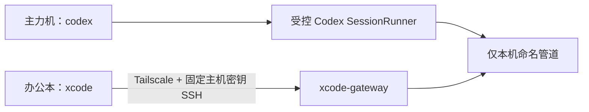

# xcode remote Codex collaboration

让两台 Windows 电脑协同同一个 Codex 对话：主力机仍输入 `codex`，办公本只输入 `xcode`。办公本能看到对话进展，也能发送消息；它不是远程桌面，也不是一台可登录主力机 PowerShell 的 SSH 终端。



## 首次：设备互联

两台机器各安装 Node.js 18+、Codex CLI 和 xcode：

```powershell
npm install --global github:hanhan761/xcode#main
```

先在主力机执行：

```powershell
xcode main
```

它会准备 Tailscale、受限 OpenSSH、`codex` 命令入口，并显示一次性 8 位配对码。

然后在办公本执行：

```powershell
xcode office
```

输入主力机显示的配对码、核对 SSH 指纹，并在主力机本地确认。配对长期有效；更换或丢失办公本时，在主力机运行 `xcode unpair` 撤销。

首次主力机配置和安全迁移需要一次 UAC，用于 Windows OpenSSH 服务与授权密钥。日常使用不需要 UAC。

## 日常：协同 Codex

主力机打开新的 PowerShell 后，照常使用：

```powershell
codex
```

或继续已有历史：

```powershell
codex resume --last
```


办公本打开 PowerShell，只需：

```powershell
xcode
```

办公本只显示主力机**当前仍在运行**的受控 Codex 会话；已退出、崩溃或仅保存在 Codex 历史中的会话不会出现。若有多个活会话，选择一个。连接后 `xcode` 始终只占用你当前这一个 PowerShell：上方是主力机 Codex 的终端镜像，下方固定是消息输入区和投递状态；不会新开窗口，也不会把远端终端控制码混进输入区。在办公本键入一条消息并回车后，状态会先显示“已排队”；如果主力机 Codex 仍停在“信任目录”等本地安全提示，消息会安全等待主力机确认。真正写入终端后状态显示“已写入主力机 Codex 终端”，随后以镜像区域出现的新输出作为实际响应依据。`已排队` 也会在主力机确实保留了未提交的本地草稿时短暂停留；方向键、历史导航、退格清空和 Ctrl+C 不会再阻塞远端。按 `Ctrl+C` 仅断开办公本并还原原来的 PowerShell，主力机 Codex 不受影响。

日常闭环：主力机以 `codex` 启动需要协作的对话，办公本用 `xcode` 加入；结束主力机对话或关闭其标签后，它会自动从办公本列表消失。需要日后继续时，在主力机执行 `codex resume --last`（或使用你的会话恢复工具）重新启动，再由办公本执行 `xcode` 加入。

## 安全边界

- Tailscale 提供两台设备之间的私有加密网络；不需要公网 IP 或路由器端口映射。
- SSH 固定主力机主机密钥，并限制办公本专用密钥的 Tailscale 源地址。
- 办公本密钥被强制进入 `xcode-gateway`，只允许探测、列出会话和附加已授权会话；不能打开 PowerShell shell、端口转发、代理或 X11。
- 每个 Codex 会话是私有 Windows PTY，拥有随机会话 id 和临时能力 token；xcode 不扫描、不附加任何现有 PowerShell、CMD 或其他终端。
- 本地与办公本的输入按完整消息序列化，避免两端按键交织。

## 已有普通 Codex 窗口

已经在 xcode 安装前启动的 Codex 不能被静默抓取。完成一次安装后，用正常命令 `codex resume --last`（或指定线程）重新打开它；从那次启动起，该对话就成为可协同会话。

## 维护

```powershell
xcode update   # 两台机器各执行一次；随后打开新的 PowerShell
xcode doctor   # 办公本检查 Tailscale、SSH 网关和会话可用性
xcode unpair   # 主力机撤销某台办公本
```
