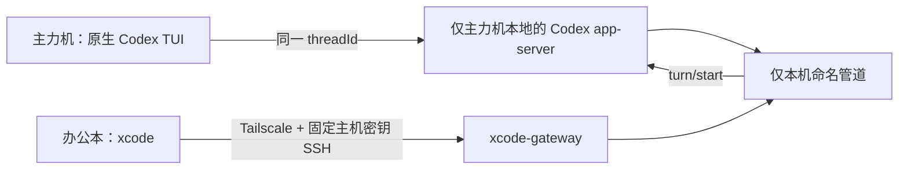

# xcode remote Codex collaboration

让两台 Windows 电脑协同同一个 Codex 对话：主力机仍输入 `codex`，办公本只输入 `xcode`。办公本能看到对话进展，也能发送消息；它不是远程桌面，也不是一台可登录主力机 PowerShell 的 SSH 终端。



## 首次：设备互联

两台机器各安装 Node.js 18+、Codex CLI 和 xcode：

```powershell
npm install --global github:hanhan761/xcode#main
```

先在主力机执行：

```powershell
xcode main
```

它会准备 Tailscale、受限 OpenSSH、`codex` 命令入口，并显示一次性 8 位配对码。

然后在办公本执行：

```powershell
xcode office
```

输入主力机显示的配对码、核对 SSH 指纹，并在主力机本地确认。配对长期有效；更换或丢失办公本时，在主力机运行 `xcode unpair` 撤销。

首次主力机配置和安全迁移需要一次 UAC，用于 Windows OpenSSH 服务与授权密钥。日常使用不需要 UAC。

## 日常：协同 Codex

主力机打开新的 PowerShell 后，照常使用：

```powershell
codex
```

或继续已有历史：

```powershell
codex resume --last
```


办公本打开 PowerShell，只需：

```powershell
xcode
```

办公本只显示主力机**当前仍在运行**的协同 Codex 会话；已退出、崩溃或仅保存在 Codex 历史中的会话不会出现。若有多个活会话，选择一个。连接后 `xcode` 始终只占用你当前这一个 PowerShell：上方是主力机 Codex 的终端镜像，下方固定是消息输入区和投递状态；不会新开窗口，也不会把远端终端控制码混进输入区。连接、全屏和窗口大小变化时，`xcode` 会同步 rows/cols、重设主力机 PTY，并重绘镜像，使内容区与边框铺满当前终端。`PgUp`/`PgDn`、`Home`/`End` 或鼠标滚轮可回看/回到实时终端输出；主力机的受管原生 Codex 会保留 scrollback，办公本在回看时不会把导航键误写进消息输入框。消息提交只在真实投递阶段显示状态，并在主力机确认后立即回到 `Ready`，不会本地无限显示“working”。办公本键入一条消息并回车后，`xcode` 会把它作为同一 `threadId` 的 Codex turn 提交；主力机原生 Codex TUI 与办公本镜像都会收到同一条事件和回复。这不是向另一个终端“模拟敲字”，也不会创建 fork。按 `Ctrl+C` 仅断开办公本并还原原来的 PowerShell，主力机 Codex 不受影响。

日常闭环：主力机以 `codex` 启动需要协作的对话，办公本用 `xcode` 加入；结束主力机对话或关闭其标签后，它会自动从办公本列表消失。需要日后继续时，在主力机执行 `codex resume --last`（或使用你的会话恢复工具）重新启动，再由办公本执行 `xcode` 加入。

启动时，`xcode` 会先显示当前阶段。恢复已有对话会复用恢复专用的本地 Codex authority；新建对话使用独立的本地 authority，避免被另一个仍在工作的恢复对话排队阻塞。若 Codex 的初始 bootstrap 请求超时，会明确报错而不会留下空白、无限卡住的 PowerShell 窗口。

恢复工具可安全重复运行：已活跃的 `threadId` 会被跳过，不会再创建第二个标签或第二个原生 Codex 客户端。

若原生 Codex 仍意外退出，主力机可查看 `%LOCALAPPDATA%\XcodeRemote\logs\managed-codex.log`。该文件只记录启动阶段、`threadId`、退出码和错误摘要，不记录对话内容。

原生 Codex 的高频光标/加载动画会先应用到内存终端，再将最终屏幕状态以最多约 13 次/秒绘制到主力机 PowerShell；中间擦行帧不会抵达 Windows Terminal，办公本仍接收完整会话事件。

## 安全边界

- Tailscale 提供两台设备之间的私有加密网络；不需要公网 IP 或路由器端口映射。
- SSH 固定主力机主机密钥，并限制办公本专用密钥的 Tailscale 源地址。
- 办公本密钥被强制进入 `xcode-gateway`，只允许探测、列出会话和附加已授权会话；不能打开 PowerShell shell、端口转发、代理或 X11。
- Codex app-server 只绑定主力机 `127.0.0.1`；办公本不能直接连接它。跨设备只有受限 SSH 网关，网关仅能提交完整消息到已授权的 `threadId`。
- 会话有随机会话 id 和临时能力 token；xcode 不扫描、不附加 PowerShell、CMD 或其他终端。
- 本地 TUI 和办公本都订阅同一个 Codex `threadId`。两端不会交织按键；办公本提交的是完整 Codex 消息。

## 已有普通 Codex 窗口

已经在 xcode 安装前启动的 Codex 不能被静默抓取。完成一次安装后，在同一项目目录用正常命令 `codex resume --last`（或 `codex resume <threadId>`）重新打开它；从那次启动起，该对话就成为可协同会话。桌面端或其他产品表面中没有暴露本地 CLI `threadId` 的对话，不能由 xcode 无损接管。

## 维护

```powershell
xcode update   # 两台机器各执行一次；随后打开新的 PowerShell
xcode doctor   # 办公本检查 Tailscale、SSH 网关和会话可用性
xcode unpair   # 主力机撤销某台办公本
```
