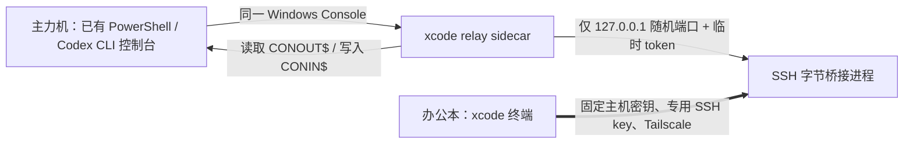

# xcode remote terminal

让一台 Windows 办公本以纯终端方式接入主力机**已经在运行的一个 PowerShell / Codex CLI 控制台**。不使用远程桌面，不新建 PowerShell 会话，也不接管或修改 WezTerm、Windows Terminal 的配置。

办公本显示的是主力机当前控制台的实时屏幕，并把键盘输入写回同一个控制台。因此它可以继续当前的 Codex 对话，而不是开一个新的对话。



## 日常使用

主力机：在**要被接入的那个终端**里执行：

```powershell
xcode
# 或 xcode share
```

办公本：打开 PowerShell，执行：

```powershell
xcode
# 或 xcode attach
```

办公本按 `Ctrl+C` 仅断开本地画面；主力机的终端、其中运行的命令和 Codex 对话都会继续。

如果目标是一个正在交互的 Codex CLI，会由 Codex 占用输入行，不能把 `xcode share` 当作普通 PowerShell 命令键入。此时让 Codex 在**当前终端**执行 `xcode share` 即可；不要在另一扇 PowerShell 窗口执行，否则共享的是另一扇窗口。

## 一次性安装与配对

两台 Windows 电脑都先安装 Node.js 18+，然后在各自 PowerShell 中安装：

```powershell
npm install --global github:hanhan761/xcode#main
```

主力机首次准备：

```powershell
xcode setup main
xcode pair
```

办公本首次准备并加入配对：

```powershell
xcode setup office
xcode pair
```

主力机 `xcode pair` 会显示一次性的 8 位码和 SSH 指纹。办公本输入该码、核对指纹后，主力机还必须本地确认该设备。配对成功后是长效的：日常只需主力机 `xcode share`、办公本 `xcode`，不再输入配对码。

首次主力机准备，以及每次新增/撤销办公本配对，Windows 会因 OpenSSH 服务或授权密钥变更请求 UAC；**日常共享和接入不需要 UAC**。

## 更新、检查与撤销

```powershell
xcode update  # 两台机器各运行一次；随后打开新的 PowerShell
xcode status
xcode doctor  # 办公本：检查 Tailscale、固定主机密钥 SSH、当前共享状态
xcode unpair  # 主力机：撤销已配对办公本
```

已配对的两台机器升级到此版本后不需要重新配对：中继沿用已有的 SSH key、Tailscale 来源限制与固定主机密钥。

## 安全边界

- 配对窗口只在主力机 Tailscale 地址上临时监听；8 位码过期即失效。
- 办公本 SSH key 限制为其 Tailscale 地址，且关闭密码登录、代理/X11 转发与 TCP 端口转发。
- 主力机中继只监听 `127.0.0.1`，端口随机且每次共享生成新的 256-bit token；不会对局域网或公网开放端口。
- 办公本不使用 SSH `-L` 端口转发；它通过已验证 SSH 的标准输入/输出建立到主力机回环中继的字节桥接。
- `xcode` 共享的是当次执行命令所在的一个 Windows Console。多个彼此独立的 PowerShell/Windows Terminal 窗口需要分别选择；当前版本一次只保留一个活动共享目标。

## 已知限制

这不是远程桌面，也不是完整终端模拟器。它镜像字符屏幕和键盘输入，适合 PowerShell、Codex CLI 等文本工作流；图形界面、鼠标操作、颜色属性、独立窗口的标签/分屏布局不会被远程重建。

Windows Console 的伪控制台机制必须在程序启动前创建，无法接管一个已经运行的控制台；本项目因此使用同一控制台内启动的轻量中继。有关这一边界可参考 Microsoft 的 [Pseudoconsole 文档](https://learn.microsoft.com/en-us/windows/console/pseudoconsoles) 和 [AttachConsole 文档](https://learn.microsoft.com/en-us/windows/console/attachconsole)。
