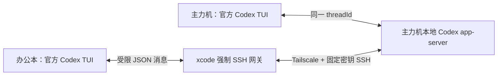

# xcode：两台 Windows 协同同一个 Codex 对话

主力机照常输入 `codex`，办公本输入 `xcode`。两端运行同版本的官方 Codex TUI，并连接到主力机上同一个活跃 `threadId`：任一端发送消息后，两端都会看到相同的用户消息、`Working` 状态、工具进展和回复。

这不是远程桌面，也不是远程 PowerShell。每台电脑保留自己的窗口尺寸、滚动位置和正在编辑的草稿；共享的是 Codex 对话与任务状态。



## 首次安装与配对

两台电脑都安装 Node.js 18+，然后执行：

```powershell
npm install --global github:hanhan761/xcode#main
```

主力机执行：

```powershell
xcode main
```

办公本执行：

```powershell
xcode office
```

按提示输入一次性配对码并在主力机确认。配对长期有效；日常连接不需要 UAC。设备丢失或更换时，在主力机执行 `xcode unpair` 撤销。

## 日常使用：只有两步

1. 主力机启动或恢复需要协同的对话：

```powershell
codex
# 或
codex resume --last
```

2. 办公本在当前 PowerShell 输入：

```powershell
xcode
```

若主力机有多个活跃对话，选择一个即可。办公本只列出当前仍在运行、由新版 xcode 管理的 Codex 对话；退出或仅保存在历史中的对话不会出现。

连接后看到的就是官方 Codex 界面，不再是 xcode 自绘的终端镜像：输入框、多行编辑、快捷键、`Working` 动画、上下滚动、全屏和窗口 resize 都由官方 TUI 处理。办公本退出官方 Codex 客户端不会结束主力机上的对话。

如果对话是在旧版 xcode 中启动的，更新后需要在主力机关闭它并用 `codex resume <threadId>` 或 `codex resume --last` 恢复一次，办公本才能以新版原生方式加入。

## 更新

主力机先结束当前受管 Codex 进程，然后两台电脑分别执行：

```powershell
xcode update
```

更新完成后打开新的 PowerShell。两端由 xcode 安装同一个经过验证的官方 Codex 版本，避免 app-server 协议版本漂移。

## 安全边界

- Tailscale 提供设备间私有网络；不开放公网端口。
- 办公本专用 SSH 密钥被强制进入 `xcode-gateway`，不能获得主力机 PowerShell shell，也不能使用 SSH 端口转发。
- Codex app-server 只监听主力机 `127.0.0.1`，其地址不会发送给办公本。
- 网关只中继当前选中的 `threadId`；拒绝会话历史枚举、新建、分叉、删除、归档以及任何其他 `threadId`。
- `xcode` 不扫描或接管其他 PowerShell、CMD、Windows Terminal 或普通 Codex 进程。

排查命令：

```powershell
xcode doctor
```

主力机生命周期日志位于 `%LOCALAPPDATA%\XcodeRemote\logs\managed-codex.log`，只记录启动阶段、`threadId`、退出码和错误摘要，不记录对话正文。

## 鼠标翻页与对话标题

- 办公本连接后，直接使用鼠标中键滚轮即可翻阅对话。第一次向上滚动会进入官方 Codex 的 transcript，继续滚动按页上翻或下翻；`Esc` 仍按官方方式退出。
- 新对话的标签页标题默认是工作目录的文件夹名。
- 在任一端的官方 Codex 输入 `/rename 新标题`，标题由 Codex 持久保存，并实时同步到主力机标签、办公本活动列表和办公本标签。
- 以后执行 `codex resume <threadId>`，或者用 `C:\Users\13081\Desktop\CodexSessionRecovery\3-resume-last-codex.cmd` 批量恢复，仍会使用修改后的长效标题。
