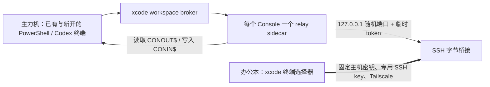

# xcode remote terminal

让一台 Windows 办公本以纯终端方式接入主力机**已经在运行的 PowerShell / Codex CLI 终端工作区**。不使用远程桌面，不新建 PowerShell 会话，也不接管或修改 WezTerm、Windows Terminal 的配置。

主力机后台会发现同一 Windows 用户下已有和随后打开的终端；办公本先选择其中一个，再显示它的实时字符屏幕并把键盘输入写回**原来的那个控制台**。因此可以继续原有 Codex 对话，而不是开一个新的对话。



## 最简连接（已安装、已配对）

1. 主力机：在**任意一个普通 PowerShell** 中执行一次：

```powershell
xcode
```

2. 办公本：打开 PowerShell，执行：

```powershell
xcode
```

3. 若出现终端列表，输入编号并回车。此后就是该主力机原终端：可以继续已有 Codex 对话、输入命令和查看输出。

`Ctrl+G` 回到并刷新终端列表；`Ctrl+C` 仅断开办公本。它们都不会停止主力机终端、命令或 Codex 对话。

主力机不需要在每个窗口执行 `xcode`。即使目标 Codex CLI 正在占用输入行，也可以在另一扇普通 PowerShell 启动一次工作区 broker；它不会创建新对话或改变已有窗口。

## 一次性安装与配对

两台 Windows 电脑都先安装 Node.js 18+，然后在各自 PowerShell 中安装：

```powershell
npm install --global github:hanhan761/xcode#main
```

主力机首次准备：

```powershell
xcode setup main
xcode pair
```

办公本首次准备并加入配对：

```powershell
xcode setup office
xcode pair
```

主力机 `xcode pair` 会显示一次性的 8 位码和 SSH 指纹。办公本输入该码、核对指纹后，主力机还必须本地确认该设备。配对成功后是长效的：日常只需主力机 `xcode share`、办公本 `xcode`，不再输入配对码。

首次主力机准备，以及每次新增/撤销办公本配对，Windows 会因 OpenSSH 服务或授权密钥变更请求 UAC；**日常共享和接入不需要 UAC**。

## 更新、检查与撤销

```powershell
xcode update  # 两台机器各运行一次；随后打开新的 PowerShell
xcode status
xcode doctor  # 办公本：检查 Tailscale、固定主机密钥 SSH、当前共享状态
xcode unpair  # 主力机：撤销已配对办公本
```

已配对的两台机器升级到此版本后不需要重新配对：中继沿用已有的 SSH key、Tailscale 来源限制与固定主机密钥。

## 安全边界

- 配对窗口只在主力机 Tailscale 地址上临时监听；8 位码过期即失效。
- 办公本 SSH key 限制为其 Tailscale 地址，且关闭密码登录、代理/X11 转发与 TCP 端口转发。
- 主力机中继只监听 `127.0.0.1`，端口随机且每次共享生成新的 256-bit token；不会对局域网或公网开放端口。
- 办公本不使用 SSH `-L` 端口转发；它通过已验证 SSH 的标准输入/输出建立到主力机回环中继的字节桥接。
- 主力机 broker 与各 relay 都只在当前 Windows 用户、同一会话下运行；无权限访问的提升权限或其他用户终端不会被静默接入。

## 已知限制

这不是远程桌面，也不是完整终端模拟器。它镜像字符屏幕和键盘输入，适合 PowerShell、Codex CLI 等文本工作流；图形界面、鼠标操作、颜色属性，以及 Windows Terminal 的标签/分屏布局不会被远程重建。

Windows Console 的伪控制台机制必须在程序启动前创建，无法接管一个已经运行的控制台；本项目改为让每个轻量 relay 附加到一个已有 Console。有关这一边界可参考 Microsoft 的 [Pseudoconsole 文档](https://learn.microsoft.com/en-us/windows/console/pseudoconsoles) 和 [AttachConsole 文档](https://learn.microsoft.com/en-us/windows/console/attachconsole)。
