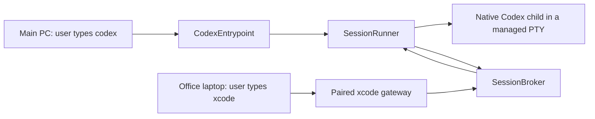

# Codex Session Handoff Design

## Product contract

The main PC keeps the user's normal command:

```powershell
codex
```

The office laptop uses:

```powershell
xcode
```

Both surfaces participate in one explicitly managed Codex conversation.
`xcode` is not a remote PowerShell login, a desktop stream, or a catalogue of
every terminal running on the main PC.

The visible workflow is deliberately asymmetric:

| Surface | User command | Responsibility |
|---|---|---|
| Main PC | `codex` | Starts or resumes the managed Codex session and remains the local terminal UI. |
| Office laptop | `xcode` | Lists only granted Codex sessions, mirrors their progress, and contributes ordered messages to the same conversation. |
| Main PC | `xcode pair`, `xcode devices`, `xcode revoke` | One-time pairing and local device authority. |

`xcode codex` is not part of the user-facing workflow. A one-time PowerShell
profile integration may implement `codex` as a tiny dispatcher internally, but
the user still invokes `codex` with its ordinary arguments and sees Codex's
ordinary terminal UI.

## Why the current scanner is retired

The old broker discovered every same-user Windows Console and attached a
relay. In a real run this published 13 unrelated shells and forced process
termination left 129 relay sidecars. That is the wrong authority boundary: a
paired laptop should receive a named Codex-session capability, never the
ability to choose arbitrary host consoles.

The official Codex app-server is a promising semantic interface for saved
thread history, but stock Codex does not presently guarantee live co-presence
between an already-running normal TUI and a second client. Therefore xcode
must not claim it can safely seize an arbitrary existing normal `codex`
process. See the upstream app-server documentation and the current
co-presence discussion:

- [Codex app-server README](https://github.com/openai/codex/blob/main/codex-rs/app-server/README.md)
- [Peer-client co-presence RFC](https://github.com/openai/codex/issues/21551)

## Session model

`SessionRunner` is the deep module. It starts one known Codex child in a
managed pseudoterminal, owns the session's byte stream, and never discovers
other processes. Its small interface is:

```text
create(codexArgs, cwd) -> Session
resume(threadId, codexArgs, cwd) -> Session
attach(deviceGrant) -> Readable session view
submitMessage(deviceGrant, message) -> Queued | Delivered
stop(session) -> void
```

A `Session` contains an opaque id, Codex thread id when known, working
directory, title, creation time, active observers and terminal dimensions. It
is not a Windows process id exposed to a remote device. A session is listable
only while its managed child remains alive and its private named pipe accepts a
local gateway probe; stale state is removed before it can reach an office
laptop.

`InputArbiter` makes the session collaborative rather than a remote takeover.
Both surfaces observe the same output. The main PC retains its ordinary
interactive terminal; the office client submits a complete message, which the
arbiter serializes with local input and injects into the one Codex terminal.
It never forwards two devices' individual keystrokes concurrently, because
that could corrupt a prompt. A pending office message is visible locally and
is delivered when the terminal can accept the next input.

## Modules and seams



- **CodexEntrypoint** preserves the `codex` command and arguments. It creates
  or resumes a named session through `SessionRunner`.
- **SessionRunner** owns one child and its PTY. It performs output fan-out and
  collaborative input arbitration; it never scans Windows Consoles.
- **SessionBroker** exposes session metadata, observation and message-submit
  operations to the local gateway. It is the only module allowed to translate
  a device grant into a session attachment.
- **Paired xcode gateway** accepts only the xcode application protocol. It is
  not an interactive shell. It bridges encrypted SSH/Tailscale stdio frames to
  the broker and may not execute arbitrary host commands.
- **Office client** is invoked by `xcode`. It renders the managed terminal and
  sends complete user messages through the input arbiter.

The first implementation gate is a Windows ConPTY proof that can start,
display, resize, interrupt, and reliably terminate one native Codex child.
WezTerm's mux may be an implementation fallback for a managed session, but it
must never reintroduce global terminal discovery.

## Pairing and security

Pairing remains one-time and long-lived, but creates a `DeviceGrant` rather
than an unrestricted SSH login. The host records the device public key,
Tailscale node identity, friendly name, creation time, and revocation state.

After pairing:

1. The office `xcode` opens the host's forced xcode gateway.
2. The gateway authenticates the paired device and offers only explicitly
   registered session metadata.
3. The office may observe immediately and submit a message. The runner queues
   that whole message alongside local input; it does not give either device a
   permanent terminal takeover.
4. Revoking the device invalidates its grant, closes its connection, and does
   not affect the local Codex child.

The gateway must bind only to loopback behind the existing Tailscale-pinned
SSH path, or use SSH stdio directly. It must not expose a WebSocket or
terminal port to the LAN, the public internet, or every Tailscale peer.

## Existing conversations and migration

There are two supported states:

- **New sessions after integration:** type `codex` as usual. The session is
  managed from its first byte and can be handed to `xcode`.
- **A prior unwrapped session:** finish or pause the current turn, then use
  normal `codex resume <thread-id>` (or `codex resume --last`) after the
  integration is installed. This opens the same Codex history as a managed
  session.

There is intentionally no silent "attach to every existing Codex window"
feature. While an unwrapped TUI is live, a second writer could produce
conflicting turns and Codex currently has no reliable stock interface for an
external collaborator to coordinate its input safely.

## Acceptance tests

1. Typing `codex` on the main PC starts one managed child without opening a
   second general PowerShell shell.
2. `xcode` on a paired office laptop lists only currently active managed
   sessions and can see their output, including work performed locally before
   it attached. Saved but inactive history is never listed.
3. An office message appears in the main-PC Codex terminal and becomes part of
   the same Codex conversation; local and remote keystrokes never interleave.
4. Reconnect preserves the Codex session and terminal state; stopping xcode
   does not stop local Codex.
5. Device revocation closes the remote stream and denies later attachment.
6. The broker enumerates zero unrelated PowerShell, CMD, Windows Terminal, or
   Codex processes.
7. Abnormal runner exit removes session state and all child/sidecar resources;
   an orphaned state file is also excluded and cleaned by the gateway's liveness
   check.
