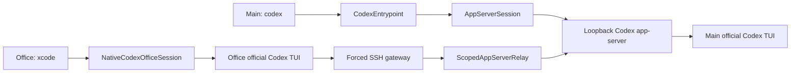

# Codex Session Handoff Design

## Product contract

The main PC keeps the normal `codex` command. The paired office laptop uses
`xcode`. Both devices run the official Codex TUI against one explicitly
selected active thread.

| Surface | Command | Responsibility |
|---|---|---|
| Main PC | `codex` | Start or resume a managed thread and keep the local official TUI. |
| Office laptop | `xcode` | List active grants, select one thread, and start a second official TUI. |
| Main PC | `xcode pair`, `xcode devices`, `xcode unpair` | Create, inspect, and revoke device authority. |

This is not a remote PowerShell login, desktop stream, terminal-byte mirror,
or catalogue of every process. Both clients share conversation events and
working state. Terminal dimensions, viewport, scroll position, cursor and
draft remain device-local.

## Why console discovery and terminal mirroring are retired

The original scanner discovered unrelated same-user consoles and made its
authority impossible to explain or revoke. The later office renderer parsed
the main TUI's ANSI bytes and rebuilt a three-row JavaScript UI. That approach
could not faithfully track upstream Codex composition, keyboard, scrolling,
status or responsive-layout behavior.

The supported seam is the official Codex app-server. The main and office TUIs
both run `codex resume --remote <endpoint> --no-alt-screen <threadId>` against
the same authority. The office endpoint is local to the office device and is
backed by a forced SSH, message-aware relay; the main app-server endpoint is
never exposed remotely.

## Session model

`AppServerSession` starts or leases a loopback-only Codex app-server, creates
or resumes one thread, and starts the main official TUI. An active state record
contains an opaque session id, the selected thread id, local app-server URL,
working directory, process id and creation time. The URL remains on the main
PC and is never included in the office session list.

A state record is listable only while its managed TUI is alive and its private
named pipe accepts a local liveness probe. Stale records are deleted before
the office client sees them. Sessions created by older schemas remain visible
to diagnostics but are not offered as native-TUI capabilities.

## Modules and seams

- **CodexEntrypoint** preserves normal `codex` arguments and starts a managed
  session using the package-pinned official Codex executable.
- **AppServerSession** owns the thread authority, main official TUI and
  lifecycle registration. It never scans Windows consoles.
- **NativeCodexOfficeSession** opens a temporary office-local loopback
  WebSocket, translates app-server messages to framed SSH stdio, launches the
  pinned official Codex binary with inherited stdio, and cleans up every child
  and socket when that local client exits.
- **ScopedAppServerRelay** is a protocol firewall. It accepts only `ws://`
  loopback targets, rejects mismatched thread ids and denies thread history
  enumeration, creation, fork, delete, archive and unarchive operations.
- **Paired gateway** is a forced SSH command, not a shell. It exposes only the
  xcode application vocabulary and cannot enable general port forwarding.
- **Terminal output coalescer** remains main-PC-only. It prevents transient
  redraw frames from flickering in the outer PowerShell without changing the
  semantic app-server stream consumed by either official TUI.

## Pairing and security

Pairing is one-time and long-lived. The main PC records a dedicated public
key, pinned Tailscale device identity, allowed source addresses and revocation
state. Daily use requires no UAC.

The office private key is restricted by the SSH authorized-key command and
options. It cannot open PowerShell, arbitrary commands, TCP forwarding, agent
forwarding, X11 or a general app-server socket. For a selected native session:

1. `xcode-gateway list` returns active metadata, `threadId`, and a capability
   flag, but never the main loopback URL or session token.
2. `xcode-gateway native <sessionId>` reads the selected state locally.
3. Each office app-server JSON message is validated before forwarding.
4. Any request for another thread or a denied lifecycle/history method closes
   the capability stream.
5. Revocation invalidates later SSH access without stopping the main TUI.

## Existing conversations and migration

New conversations started with the integrated `codex` command are
collaborative immediately. A saved conversation can be reopened with `codex
resume <threadId>` or `codex resume --last`; the resumed managed process then
becomes office-listable.

An already-running unwrapped or old-schema process cannot be silently seized.
After updating, close it once and resume it through the managed entrypoint.
Desktop conversations with no compatible local CLI thread id remain outside
scope.

## Acceptance tests

1. Main `codex` starts one official TUI and a loopback authority without a
   visible helper console.
2. Office `xcode` lists only active schema-v3 sessions and starts the official
   TUI in the current PowerShell.
3. A message typed on office produces the same turn, `Working` state, tool
   progress and response on both official clients.
4. Each client adapts independently to startup size, full screen and resize;
   scrolling or editing a draft on one client does not resize or corrupt the
   other.
5. Exiting office does not stop the main thread. Reconnecting resumes the same
   active thread.
6. The gateway enumerates no unrelated shell or Codex process.
7. A malicious paired client cannot list history, create, fork, delete,
   archive, unarchive or access a different thread through the relay.
8. Abnormal exit removes session state and all bridge resources.

Upstream references:

- [OpenAI Codex source](https://github.com/openai/codex)
- [Official Codex Rust TUI](https://github.com/openai/codex/tree/main/codex-rs/tui/src)
- [Codex app-server README](https://github.com/openai/codex/blob/main/codex-rs/app-server/README.md)
